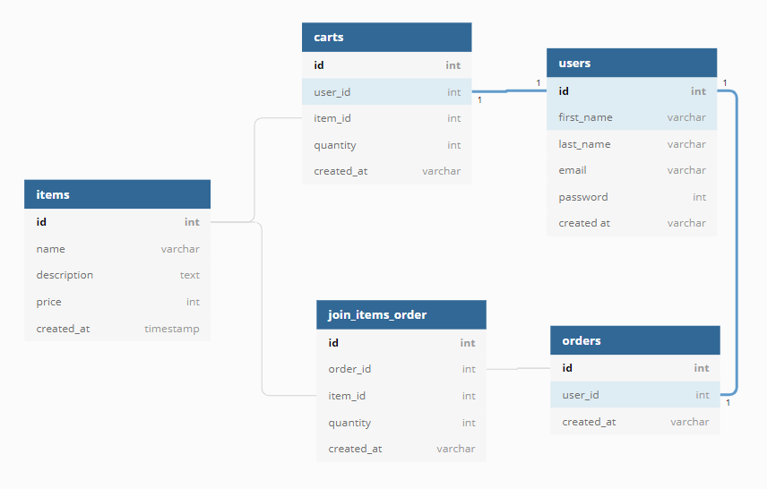

# Project : FindNewKittens

##### To see our website click on this link 👉 [e-commerce-chatons](https://e-commerce-chatons-fnf.herokuapp.com/) 

## Presentation 
This website is an online store of ~~cute~~ very cute cats pictures, you can : 
- see all the pictures on the main page 
- add the one you like in your cart 
- buy the picture with stripe 
- receive a confirmation email after the payment 

## Database

## Clone & Setup

- 👯 Clone this repo to your local machine using: `git clone https://github.com/findnewfriends/e-commerce-chaton.git`

- Then, do the following commands : 
    - `bundle install`
    - ` rails db:create`
    - `rails db:migrate`
    -  `rails db:seed`

## Our Team

Alexis Lafrance => https://github.com/alafrance

Antu Nehuen => https://github.com/katehuen

Tomaz Medrado => https://github.com/tmedrado

Valentin Figueiredo => https://github.com/Valentinmf 

Virginie Lenoir => https://github.com/Virginie-lnr 
